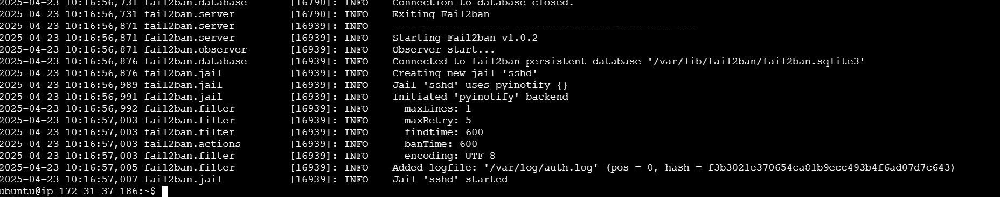

# Basic Linux Security Setup (Firewalls, UFW, and Fail2Ban)

## Project Overview:

To secure a Linux server using basic firewall rules with UFW (Uncomplicated Firewall) and protect it from brute force attacks with Fail2Ban.

## Prerequisites:

* A Linux-based server (e.g., Ubuntu 20.04 or higher)
* Root or sudo access to the server
* Basic understanding of Linux commands and SSH

# Step-by-Step Implementation:

### Step 1 - Update and Upgrade the System

* It's important to start by updating the system to ensure all packages are up-to-date and secure.

```
sudo apt update && sudo apt upgrade -y
```

### Step 2: Install UFW (Uncomplicated Firewall)

* UFW is a user-friendly front-end for managing iptables, the Linux firewall. By default, UFW is often pre-installed on Ubuntu, but you can install it if it's not present:

```
sudo apt install ufw
```

* Check the status of UFW:

```
sudo ufw status
```

* If UFW is inactive, activate it after setting up the firewall rules (we'll do this shortly).

### Step 3: Configure Basic UFW Rules

Here, we'll allow essential services and block everything else. Common services to allow are SSH, HTTP, and HTTPS.

* Allow SSH: If you're managing the server remotely, you need to allow SSH connections to avoid getting locked out.

```
sudo ufw allow ssh
```


* Allow HTTP (Web Traffic) if running a web server:

```
sudo ufw allow http
```


* Allow HTTPS (Secure Web Traffic):

```
sudo ufw allow https
```


* Enable UFW: After setting up the rules, enable the firewall to apply them.

```
sudo ufw enable
```


* Check UFW Status and Rules: You can verify that the firewall is active and check the rules:

```
sudo ufw status verbose
```

This will show the firewall’s status and the currently allowed connections.


### Step 4: Install Fail2Ban

Fail2Ban is a tool that scans log files for malicious activity (e.g., multiple failed login attempts) and automatically bans IPs exhibiting such behavior.

* Install Fail2Ban:

```
sudo apt install fail2ban
```

* Configure Fail2Ban: Fail2Ban's configuration files are located in /etc/fail2ban/. The default configuration is found in jail.conf, but it's best practice to copy this file to jail.local to avoid overwriting changes during updates.

```
sudo cp /etc/fail2ban/jail.conf /etc/fail2ban/jail.local
```

* Modify Fail2Ban Configuration: Open the jail.local file to make changes. Use nano or any text editor of your choice.

```
sudo nano /etc/fail2ban/jail.local
```

In this file, you can set the basic configurations for Fail2Ban. Focus on the [DEFAULT] and [sshd] sections.

Example configuration for [DEFAULT]:

```
[DEFAULT]
bantime  = 10m         # Time an IP remains banned
findtime  = 10m        # Time window during which maxretry count is checked
maxretry = 5           # Max failed login attempts before ban
```

For the [sshd] section (to protect SSH from brute force attacks), ensure it is enabled:

```
[sshd]
enabled = true
```
* Restart Fail2Ban: After making changes, restart Fail2Ban to apply the configurations:

```
sudo systemctl restart fail2ban
```

* Check Fail2Ban Status: Verify that Fail2Ban is running and monitoring services like SSH:

```
sudo fail2ban-client status
```


To see more details about the SSH jail (which tracks SSH logins):

```
sudo fail2ban-client status sshd
```


### Step 5: Testing UFW and Fail2Ban

* Test UFW Rules: You can attempt to access the server through ports that are not allowed by UFW to confirm that they are blocked. For instance, trying to connect to a non-allowed port should result in a timeout.

diagram

Test Fail2Ban: To test Fail2Ban, you can attempt to SSH into your server with incorrect passwords multiple times (use a different machine or IP to avoid locking yourself out). After hitting the max retries, Fail2Ban should ban your IP.

To check banned IPs:

```
sudo fail2ban-client status sshd
```

* To unban an IP:

```
sudo fail2ban-client set sshd unbanip <IP-ADDRESS>
```





### Step 6: Additional Hardening (Optional)

For extra security, consider the following:

* Change SSH Port: Changing the default SSH port (22) can reduce the number of automated attacks.

```
sudo vim /etc/ssh/sshd_config
```

Find the line #Port 22 and change it to a different port (e.g., Port 2222), then restart SSH:

```
sudo systemctl restart ssh
```

Don't forget to update your UFW rules to allow the new port:

```
sudo ufw allow 2222/tcp
```


* Disable Root Login via SSH: Prevent direct SSH login for the root user by setting the following in the SSH configuration:

```
PermitRootLogin no
```

* Use SSH Key Authentication: Set up SSH key authentication for added security. You can disable password authentication entirely once keys are set up by updating the SSH configuration:

```
PasswordAuthentication no
```

### Step 7: Ongoing Maintenance

* Regularly update the system to ensure all packages are patched and secure.

```
sudo apt update && sudo apt upgrade -y
```

* Monitor UFW and Fail2Ban logs to review potential attacks and security issues.

UFW logs are found at ```/var/log/ufw.log 
                      ```.

Fail2Ban logs are found at ```/var/log/fail2ban.log
                           ```.

# Conclusion:

This project sets up basic security measures to protect your Linux server by:

* Configuring a firewall with UFW to control traffic.

* Installing and configuring Fail2Ban to prevent brute force attacks.

* Optionally securing SSH by changing ports, disabling root login, and using SSH keys.


PROJECT COMPLETED!🎉